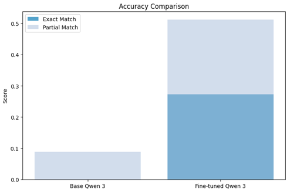
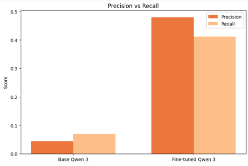
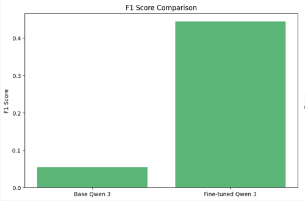
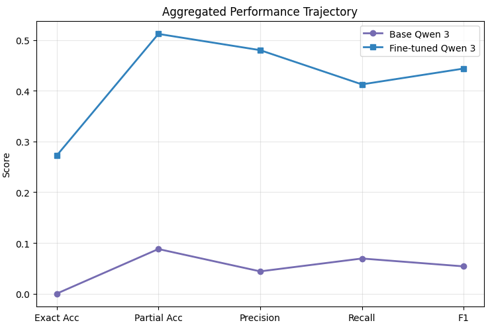

# Patent IPC Classification Pipeline via Qwen 3

This repository contains a professional pipeline for efficient fine-tuning of the **Qwen 3** language model (**Causal LM** architecture) for the task of automatic patent classification according to the **International Patent Classification (IPC)** system.

The project implements **Masked Instruction Fine-Tuning (Target-Only Masking)** using the `trl` library, which eliminates gradient noise caused by prompt tokens and focuses the computation of the loss function (**Cross-Entropy Loss**) exclusively on the assistant's responses.

---

⚙️ Inference Pipeline

For evaluation and inference, the model operates in a chat-based format using the native Qwen 3 chat template.

The system prompt constrains the model to generate only valid 3-character IPC codes, while the user prompt contains a truncated patent abstract. Generation is performed with low-temperature sampling to minimize hallucinations and encourage deterministic outputs.

```python
messages = [
    {
        "role": "system",
        "content": (
            "You are an expert patent classifier. "
            "Classify patents using 3-character IPC codes "
            "(e.g. B23, H01). "
            "Provide only the codes separated by commas, "
            "no duplicates."
        )
    },
    {
        "role": "user",
        "content": f"Patent: {text[:200]}"
    }
]

formatted_text = tokenizer.apply_chat_template(
    messages,
    tokenize=False,
    add_generation_prompt=True,
    enable_thinking=False
)
```

The generated output is decoded and post-processed to obtain the final IPC prediction.

🏗️ Training Data Preparation

Training examples are transformed into a conversational format consisting of system, user, and assistant messages. The assistant response contains the ground-truth IPC labels.

```python
messages = [
    {
        "role": "system",
        "content": (
            "You are an expert patent classifier. "
            "Classify patents using 3-character IPC codes "
            "(e.g. B23, H01). "
            "Provide only the codes separated by commas, "
            "no duplicates."
        )
    },
    {
        "role": "user",
        "content": f"Patent: {example['text'][:200]}"
    },
    {
        "role": "assistant",
        "content": example['ipc_codes']
    }
]
```

After applying the chat template, the dataset is tokenized with a maximum sequence length of 512 tokens.

To implement Target-Only Masking, the loss is computed exclusively on assistant-generated tokens. All preceding prompt tokens are masked using:


```python
response_template = "<|im_start|>assistant\n"

data_collator = CompletionOnlyDataCollator(
    tokenizer=tokenizer,
    response_template=response_template,
)
```

This approach prevents gradients from being affected by prompt engineering artifacts and focuses optimization solely on the target IPC labels.

## 📊 Performance Metrics

The table below compares the baseline model and the fine-tuned checkpoint. Evaluation was performed using both a strict **Exact Match** criterion and more flexible multi-class classification metrics.

| Metric                     | Base Qwen 3 | Fine-tuned Qwen 3 | Improvement (Delta) |
| :------------------------- | :---------: | :---------------: | :-----------------: |
| **Exact Match Accuracy**   |    0.000    |     **0.272**     |        +27.2%       |
| **Partial Match Accuracy** |    0.088    |     **0.512**     |        +42.4%       |
| **Average Precision**      |    0.044    |     **0.480**     |        +43.6%       |
| **Average Recall**         |    0.069    |     **0.413**     |        +34.4%       |
| **F1 Score**               |    0.054    |     **0.444**     |        +39.0%       |

---

## 🛠️ Training Architecture and Configuration

The training process was fully optimized for deployment on commercially accessible server hardware.

* **Hardware:** Single **NVIDIA Tesla T4** GPU (16 GB VRAM).
* **Parameter Efficiency:** **LoRA (Low-Rank Adaptation)** was employed with rank $r=16$ and scaling factor $\alpha=32$. Less than 2% of the model parameters were updated.
* **Loss Isolation (Target-Only Masking):** Using `DataCollatorForCompletionOnlyLM`, all prompt tokens preceding the `<|im_start|>assistant\n` tag were masked out, ensuring that the loss was computed solely on assistant-generated tokens.

## Production Inference Reference

This section demonstrates how to initialize the fine-tuned checkpoint from local storage and execute standalone inference on unseen raw patent text using the unified chat template format.

### Training Logs and Convergence

The model demonstrated stable convergence, with both training and validation losses steadily decreasing throughout the entire training run (149 steps):

| Step            | Training Loss | Validation Loss |
| :-------------- | :-----------: | :-------------: |
| 25              |    0.794368   |     0.514481    |
| 50              |    0.439181   |     0.434189    |
| 75              |    0.433634   |     0.384287    |
| 100             |    0.410555   |     0.386848    |
| 125             |    0.404966   |     0.363983    |
| **149 (Final)** |  **0.377406** |   **0.361086**  |


---

## 📈 Evaluation Visualizations

### 1. Exact vs Partial Match Accuracy

The base model is practically incapable of producing outputs in the required IPC format without prior adaptation. After fine-tuning, the model successfully extracts at least one valid IPC code in more than half of the evaluated cases.



### 2. Precision and Recall

Fine-tuning substantially reduced hallucinations: instead of generating arbitrary text, the model learned to focus on tokens corresponding to IPC classification codes.



### 3. Aggregate Metrics and Performance Trajectory

The summary plots clearly illustrate the substantial improvement achieved across all monitored patent classification metrics.






## Reproducibility: How to Run

To reproduce the results, use the notebook `MAIN.ipynb`.

### 1. Install dependencies

This repository now includes a root-level `requirements.txt` generated from the imports and package setup used in `MAIN.ipynb`.

```bash
pip install -r requirements.txt
```

### 2. Run the notebook

Choose one of the following environments:

- Google Colab (recommended): Open `MAIN.ipynb`, switch runtime to GPU (Tesla T4 or equivalent), and run all cells.
- Local VS Code / Jupyter: Open `MAIN.ipynb` in VS Code and run all cells in order using a Python environment with the installed dependencies.

### 3. Dataset path

The notebook expects the sample dataset at:

`data/patent_sample_data.csv`

No additional setup is required if you run from the project root.


